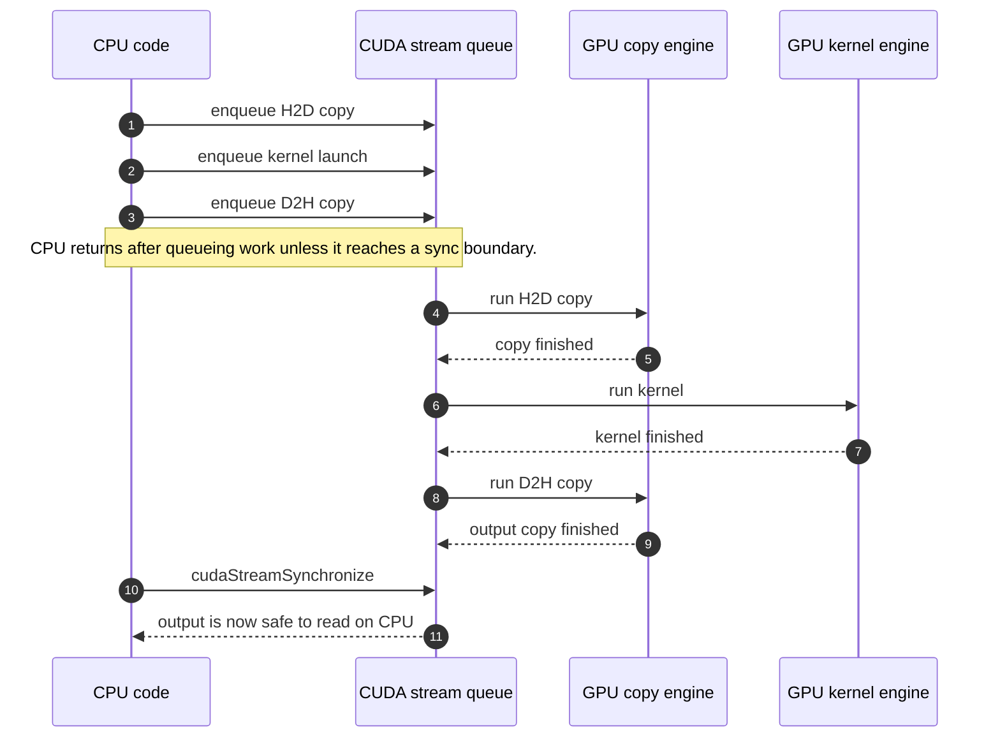
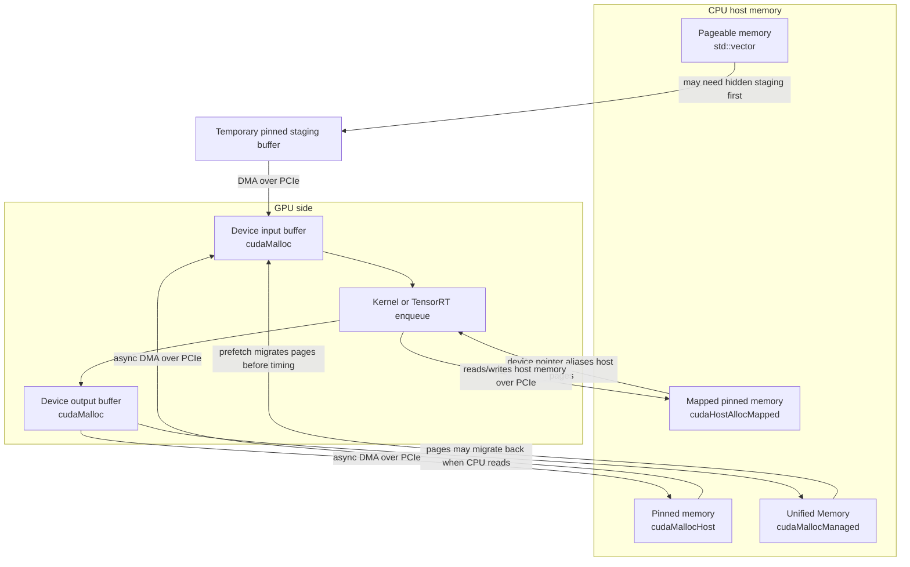

# 04 - CUDA Memory And Stream

## Purpose

- Learn the CUDA concepts needed for TensorRT inference code.

TensorRT inference code is mostly resource orchestration:

```text
CPU input tensor
  -> host-to-device copy
  -> enqueue inference on a CUDA stream
  -> device-to-host copy for outputs
  -> synchronize only when CPU code needs the result
```

If the memory type or synchronization point is wrong, the model may still produce correct output,
but latency and throughput can be much worse. This lesson uses a tiny CUDA kernel as a stand-in for
TensorRT inference so the memory behavior is easy to inspect before adding TensorRT APIs.

## Prerequisites

- Complete `00_environment_check` in the pinned development container.
- An accessible NVIDIA GPU is required for the runnable CUDA artifact.

## Deliverables

- `cuda_memory_stream` executable with focused CUDA memory-flow helpers
- Explicit-copy, mapped-memory, and managed-memory execution modes
- Per-mode correctness and CUDA-event timing output

## Data Flow

The program creates a synthetic `float32` tensor shaped like one YOLO input:

```text
[1, 3, 640, 640] = 1,228,800 float values
```

It then compares four paths:

- Pageable host memory: `std::vector<float>` plus `cudaMemcpyAsync`.
- Pinned host memory: `cudaMallocHost` plus `cudaMemcpyAsync`.
- Mapped pinned memory: `cudaHostAllocMapped`, no explicit copy, kernel accesses host memory through
  a device pointer.
- Unified Memory: `cudaMallocManaged` with explicit prefetch before the measured kernel loop.

CUDA 13 changed `cudaMemPrefetchAsync` from an integer destination to an explicit
`cudaMemLocation` plus flags. The lesson keeps the compatibility detail in two small helpers so the
data-flow example remains readable while still compiling against the pinned CUDA 13.0 toolkit.

Each path runs:

```text
input[i] -> output[i] = input[i] * 2 + 1
```

The output is validated on the CPU so this lesson checks correctness, not just timing.

## Directory Layout

- `CMakeLists.txt`: target-based CUDA/C++17 build file for this runnable lesson.
- `include/cuda_memory_demo.hpp`: small public config and lesson entry point.
- `src/main.cpp`: command-line parsing and error reporting.
- `src/cuda_memory_demo.cu`: RAII CUDA wrappers, memory allocation paths, kernel launch, timing, and
  validation.

The code keeps CUDA resources behind small RAII classes so later lessons can extend the same habit
toward TensorRT engines, execution contexts, streams, and buffers.

## Visual Mental Model

If you are new to CUDA, read this section before the bullet list below. The important idea is not
"copy is slow" or "streams are magic"; it is that CPU memory, GPU memory, and queued GPU work live
behind different boundaries.

### One Inference-Like Stream



The stream is an ordered queue. Work submitted to the same stream runs in order, so TensorRT-style
code usually queues input copy, inference, and output copy on one stream, then synchronizes only
when CPU code really needs the output.

### Memory Choices



This lesson compares four ways to feed the same simple kernel. The output can be correct in all
paths, but the data movement cost and synchronization behavior can be very different.

## Key Takeaways

- `cudaMemcpyAsync` only behaves like a useful asynchronous transfer when the host memory is pinned.
- Pageable memory can require internal staging before the GPU transfer starts.
- Mapped pinned memory avoids an explicit `cudaMemcpy`, but on a discrete GPU the kernel still reads
  and writes host memory over PCIe.
- Unified Memory makes ownership simple, but page migration can add latency unless access patterns
  are controlled with prefetching or careful warmup.
- CUDA events measure GPU work queued in a stream; CPU timers measure a different boundary.
- In TensorRT code, call `enqueue` and copies on the same stream, then synchronize only where the CPU
  must consume the output.

## Build

Run the lesson commands from its directory:

```bash
cd 04_cuda_memory_stream
cmake -S . -B build
cmake --build build
```

## Run

Run with the default tensor size and 20 measured iterations:

```bash
./build/cuda_memory_stream
```

Run a faster smoke test:

```bash
./build/cuda_memory_stream 262144 5
```

Use a larger buffer to make transfer cost easier to see:

```bash
./build/cuda_memory_stream 4194304 20
```

## Outputs

The program prints:

- CUDA device name
- whether mapped host memory is supported
- buffer size
- average time per path
- approximate copy bandwidth for explicit-copy and mapped paths
- CPU validation result

Example table:

```text
Path                                                     avg time    copy bandwidth     check
---------------------------------------------------------------------------------------------
pageable host: H2D + kernel + D2H                        0.637 ms       14.37 GiB/s      pass
pinned host: async H2D + kernel + D2H                    0.505 ms       18.13 GiB/s      pass
mapped pinned: kernel reads/writes host memory           0.560 ms       16.35 GiB/s      pass
unified memory: prefetched kernel access                 0.004 ms         n/a      pass
```

Exact numbers depend on GPU, PCIe generation, CPU memory speed, current clocks, and whether the
first run paid extra initialization cost.

## Checkpoints

- Change `iterations` from `5` to `50` and observe whether average time stabilizes.
- Compare default input size with `4194304` elements and explain which path becomes bandwidth-bound.
- Remove pinned memory from the explicit-copy path mentally: explain why overlap with inference would
  become unreliable.
- Explain why mapped pinned memory can be attractive for tiny metadata but risky for large image
  tensors on a discrete GPU.


## Appendix: CUDA Function Qualifiers

CUDA uses function qualifiers to say where a function runs and who is allowed to call it. In this
lesson, `transform_kernel` is marked with `__global__` because CPU code launches it onto the GPU
stream.

| Qualifier | Runs on | Called from | Return type | Typical use |
| --- | --- | --- | --- | --- |
| `__global__` | GPU device | Host code, and on supported devices also device code with dynamic parallelism | Must return `void` | Kernel entry points launched with `<<<grid, block, shared_memory, stream>>>`. This is the boundary where CPU code queues GPU work. |
| `__device__` | GPU device | Device code | Any supported device-callable type | Helper functions used by kernels, such as math, indexing, coordinate transforms, or small reusable operations. |
| `__host__` | CPU host | Host code | Normal C++ return types | Ordinary CPU functions. CUDA treats unqualified C++ functions as host functions by default. |
| `__host__ __device__` | CPU host and GPU device | Host code and device code | Any type valid in both compilation modes | Small utilities that should compile for both sides, as long as they avoid APIs or language features unavailable on the device. |

The important distinction is that `__global__` describes a kernel launch boundary, while
`__device__` describes GPU-only helper code. A `__global__` function is queued from the CPU and runs
many threads on the GPU; a `__device__` function is called by those GPU threads like a normal helper.

## Appendix: CUDA Allocation Choices

| API | Allocates | Key characteristics | Typical use in inference code |
| --- | --- | --- | --- |
| `cudaMalloc` | Device memory | Memory lives in GPU device memory. CPU code cannot directly dereference the pointer. Data must be moved with copies such as `cudaMemcpyAsync`, or produced by GPU work. | Tensor input/output bindings, intermediate device buffers, and any buffer that kernels or TensorRT enqueue calls access repeatedly. |
| `cudaMallocHost` | Pinned host memory | Allocates page-locked CPU memory. It costs more to allocate than normal pageable memory, but enables efficient DMA transfers and useful `cudaMemcpyAsync` behavior. Free with `cudaFreeHost`. | Reusable CPU staging buffers for input upload and output download, especially when copies should overlap with GPU work on streams. |
| `cudaHostAlloc` | Pinned host memory with selectable flags | More configurable pinned allocation. It can allocate ordinary pinned memory, mapped pinned memory, portable pinned memory, or write-combined pinned memory depending on flags. Free with `cudaFreeHost`. | Special host buffers when you need mapped host access, cross-context portability, write-mostly upload staging, or a combination of these behaviors. |
| `cudaMallocManaged` | Unified Memory | Allocates one managed pointer visible to CPU and GPU. Pages migrate between processors on demand or through explicit `cudaMemPrefetchAsync`. Convenience is high, but uncontrolled migration can add latency. Free with `cudaFree`. | Teaching, prototypes, irregular data structures, or workloads where simpler ownership matters more than tightly controlled latency. Use prefetching before latency-sensitive GPU work. |

`cudaHostAlloc` flag summary:

| Flag | Meaning | Notes |
| --- | --- | --- |
| `cudaHostAllocDefault` | Default pinned host allocation | Similar intent to `cudaMallocHost`: page-locked host memory suitable for faster transfers. |
| `cudaHostAllocMapped` | Maps the host allocation into the device address space | Use `cudaHostGetDevicePointer` to get the device-visible pointer. On a discrete GPU, kernel reads and writes still travel over PCIe, so this is usually better for small or sparse access than large image tensors. |
| `cudaHostAllocPortable` | Makes the pinned allocation portable across CUDA contexts | Useful in multi-context programs. Most simple single-device lessons do not need it. |
| `cudaHostAllocWriteCombined` | Allocates write-combined host memory | Can improve CPU-to-GPU upload bandwidth for CPU write-only staging, but CPU reads from this memory are slow. Avoid it for buffers the CPU must read back often. |

Flags can be combined with bitwise OR when the combination makes sense, for example
`cudaHostAllocMapped | cudaHostAllocPortable`.
