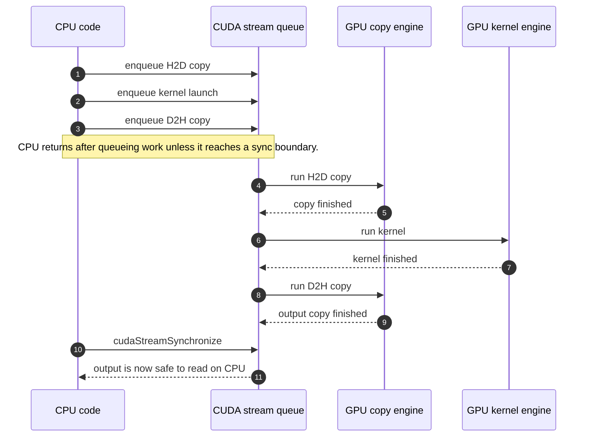
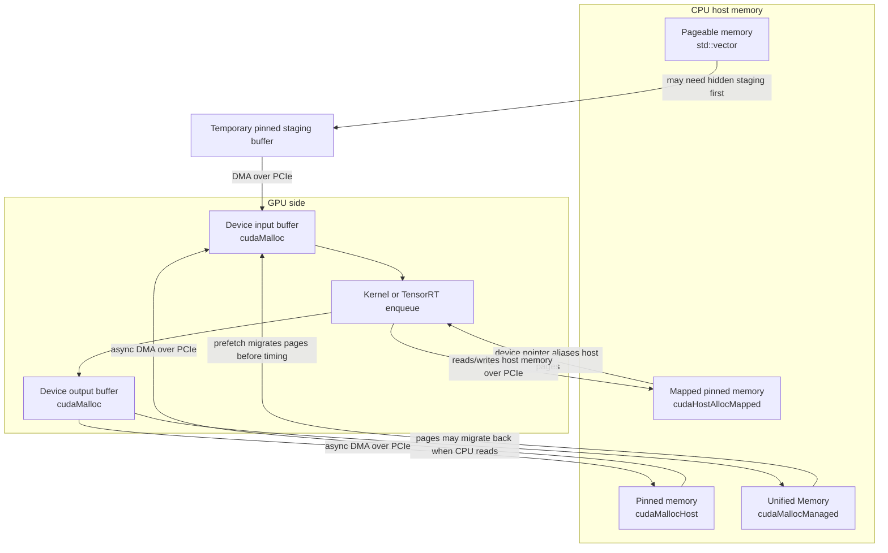
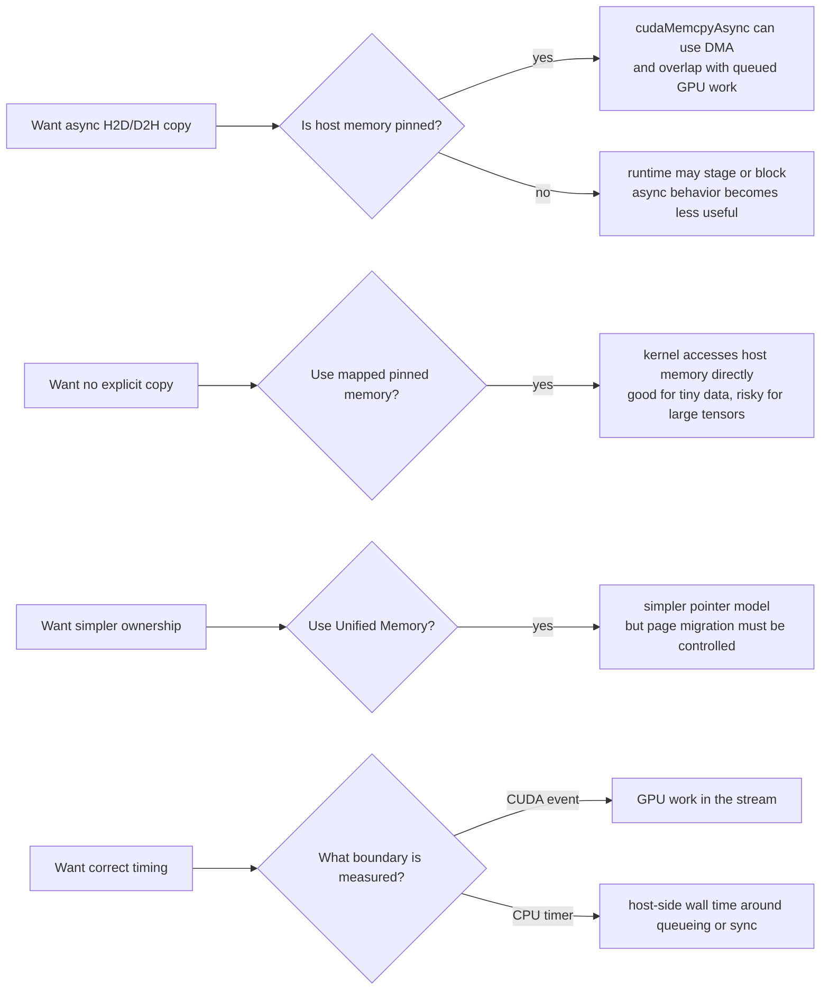

# 04 - CUDA Memory And Stream

This lesson introduces the CUDA runtime concepts that appear in TensorRT C++ inference code.

Goal: understand how host buffers, device buffers, streams, async copies, mapped pinned memory, and
Unified Memory affect an inference-like data path.

Topics:

- `cudaMalloc` and `cudaFree`
- Pinned host memory with `cudaMallocHost`
- Mapped pinned memory with `cudaHostAllocMapped`
- Unified Memory with `cudaMallocManaged`
- `cudaMemcpyAsync`
- `cudaStream_t`
- CUDA events for timing
- Synchronization boundaries

## Why This Matters

TensorRT inference code is mostly resource orchestration:

```text
CPU input tensor
  -> host-to-device copy
  -> enqueue inference on a CUDA stream
  -> device-to-host copy for outputs
  -> synchronize only when CPU code needs the result
```

If the memory type or synchronization point is wrong, the model may still produce correct output,
but latency and throughput can be much worse. This lesson uses a tiny CUDA kernel as a stand-in for
TensorRT inference so the memory behavior is easy to inspect before adding TensorRT APIs.

## Data Flow

The program creates a synthetic `float32` tensor shaped like one YOLO input:

```text
[1, 3, 640, 640] = 1,228,800 float values
```

It then compares four paths:

- Pageable host memory: `std::vector<float>` plus `cudaMemcpyAsync`.
- Pinned host memory: `cudaMallocHost` plus `cudaMemcpyAsync`.
- Mapped pinned memory: `cudaHostAllocMapped`, no explicit copy, kernel accesses host memory through
  a device pointer.
- Unified Memory: `cudaMallocManaged` with explicit prefetch before the measured kernel loop.

Each path runs:

```text
input[i] -> output[i] = input[i] * 2 + 1
```

The output is validated on the CPU so this lesson checks correctness, not just timing.

## Directory Layout

- `CMakeLists.txt`: target-based CUDA/C++17 build file for this runnable lesson.
- `include/cuda_memory_demo.hpp`: small public config and lesson entry point.
- `src/main.cpp`: command-line parsing and error reporting.
- `src/cuda_memory_demo.cu`: RAII CUDA wrappers, memory allocation paths, kernel launch, timing, and
  validation.

The code keeps CUDA resources behind small RAII classes so later lessons can extend the same habit
toward TensorRT engines, execution contexts, streams, and buffers.

## Build

```bash
cmake -S . -B build
cmake --build build
```

## Run

Run with the default tensor size and 20 measured iterations:

```bash
./build/cuda_memory_stream
```

Run a faster smoke test:

```bash
./build/cuda_memory_stream 262144 5
```

Use a larger buffer to make transfer cost easier to see:

```bash
./build/cuda_memory_stream 4194304 20
```

## Output

The program prints:

- CUDA device name
- whether mapped host memory is supported
- buffer size
- average time per path
- approximate copy bandwidth for explicit-copy and mapped paths
- CPU validation result

Example table:

```text
Path                                                     avg time    copy bandwidth     check
---------------------------------------------------------------------------------------------
pinned host: async H2D + kernel + D2H                    0.334 ms        5.84 GiB/s      pass
mapped pinned: kernel reads/writes host memory           0.194 ms       10.06 GiB/s      pass
unified memory: prefetched kernel access                 0.008 ms             n/a      pass
```

Exact numbers depend on GPU, PCIe generation, CPU memory speed, current clocks, and whether the
first run paid extra initialization cost.

## Visual Mental Model

If you are new to CUDA, read this section before the bullet list below. The important idea is not
"copy is slow" or "streams are magic"; it is that CPU memory, GPU memory, and queued GPU work live
behind different boundaries.

### One Inference-Like Stream



The stream is an ordered queue. Work submitted to the same stream runs in order, so TensorRT-style
code usually queues input copy, inference, and output copy on one stream, then synchronizes only
when CPU code really needs the output.

### Memory Choices



This lesson compares four ways to feed the same simple kernel. The output can be correct in all
paths, but the data movement cost and synchronization behavior can be very different.

### How To Read The Key Takeaways



## Key Takeaways

- `cudaMemcpyAsync` only behaves like a useful asynchronous transfer when the host memory is pinned.
- Pageable memory can require internal staging before the GPU transfer starts.
- Mapped pinned memory avoids an explicit `cudaMemcpy`, but on a discrete GPU the kernel still reads
  and writes host memory over PCIe.
- Unified Memory makes ownership simple, but page migration can add latency unless access patterns
  are controlled with prefetching or careful warmup.
- CUDA events measure GPU work queued in a stream; CPU timers measure a different boundary.
- In TensorRT code, call `enqueue` and copies on the same stream, then synchronize only where the CPU
  must consume the output.

## Checkpoints

- Change `iterations` from `5` to `50` and observe whether average time stabilizes.
- Compare default input size with `4194304` elements and explain which path becomes bandwidth-bound.
- Remove pinned memory from the explicit-copy path mentally: explain why overlap with inference would
  become unreliable.
- Explain why mapped pinned memory can be attractive for tiny metadata but risky for large image
  tensors on a discrete GPU.

Acceptance criteria:

- The program builds and runs as one executable.
- It allocates device, pinned host, mapped pinned host, and managed buffers.
- It queues copy and kernel work on CUDA streams.
- It uses CUDA events for timing.
- It validates the output for every supported path.
- You can explain why unnecessary synchronization hurts latency.
