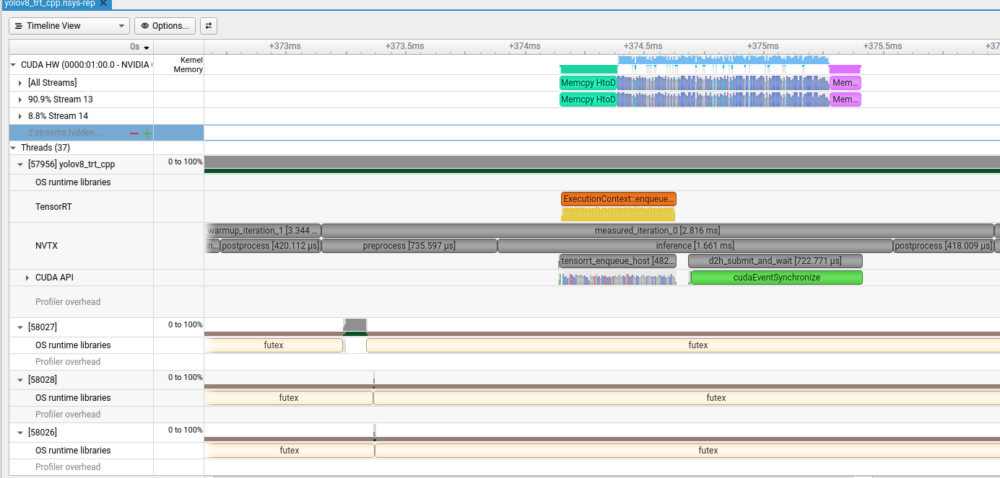

# 13 - Nsight Performance Diagnosis

## Purpose

- Replace guesswork with timeline-based performance diagnosis.
- Profiling immediately after the first C++ pipeline gives you a baseline before optimization.
- High-end deployment roles expect evidence: latency tables, profiler traces, and bottleneck explanations.

A new TensorRT execution context can have an expensive first inference. Launching a new process for
every sample repeatedly measures that cold path and can produce a false bottleneck diagnosis.

This lesson instead runs the pipeline repeatedly inside one C++ process:

```text
engine/context/stream initialization
  -> warmup iterations (reported separately)
  -> measured iterations (steady-state percentiles)
  -> visualization and report writing
```

The automatic diagnosis is deliberately a heuristic. The Nsight timeline remains the final source
of truth for CPU gaps, CUDA API blocking, memory copies, and kernel placement. The capture does not
enable Nsight's optional `--cuda-memory-usage` mode: with the pinned CUDA 13.0/Nsight 2025.5 stack
that mode crashes during TensorRT execution-context teardown, while ordinary CUDA tracing records
the allocation APIs needed by this lesson without changing application behavior.

## Prerequisites

Complete lessons 06 and 11 first:

```bash
python3 06_trtexec_engine/build_and_benchmark.py --builds static_fp32
cmake -S 11_yolov8_trt_cpp -B 11_yolov8_trt_cpp/build
cmake --build 11_yolov8_trt_cpp/build
nsys --version
```

## Deliverables

- `profile_yolov8_cpp.py` strict Nsight Systems capture workflow
- Ignored capture, SQLite, statistics, environment, and summary artifacts
- CPU-only tests for command construction and evidence gates

## Runnable Artifact

- `profile_yolov8_cpp.py`: builds lesson 11, runs an in-process steady-state benchmark, loads the
  matching lesson 06 `trtexec` timing JSON when available, captures Nsight Systems with the
  image-specific HPC-X preload removed, and writes JSON
  and Markdown reports.
- `tests/test_profile_yolov8_cpp.py`: focused tests for percentile, schema-validation, composition,
  and diagnosis behavior.

Generated files go to `outputs/`, which is ignored by git.
`diagnosis_summary.json` records the TensorRT/CUDA/GPU/driver/container identity plus the profiled
engine and image SHA-256 values so later checkpoints
can reject diagnosis evidence collected from a different engine.

## Reading The Timeline

Open the report:

```bash
nsys-ui outputs/nsys/yolov8_trt_cpp.nsys-rep
```

Use the NVTX ranges to navigate:

- `warmup_iteration_0`: compare first-inference GPU work with later iterations.
- `measured_iteration_*`: inspect representative steady-state requests.
- `preprocess` and `postprocess`: identify CPU-heavy regions.
- `h2d_submit`, `tensorrt_enqueue_host`, and `d2h_submit_and_wait`: relate CUDA API submission and
  synchronization to the CUDA HW row.

Then verify whether H2D, TensorRT kernels, and D2H execute in order, whether the CPU creates gaps,
and whether synchronization leaves the GPU idle between requests.

## Run

```bash
python3 13_nsight_performance_diagnosis/profile_yolov8_cpp.py
```

Defaults:

- 5 warmup iterations and 50 measured baseline iterations
- 2 warmup iterations and 5 measured iterations in the Nsight capture
- P99 warning when fewer than 100 measured baseline samples are used

Run a fast smoke diagnosis without Nsight:

```bash
python3 13_nsight_performance_diagnosis/profile_yolov8_cpp.py \
  --warmup-iterations 2 \
  --iterations 5 \
  --skip-nsys
```

Collect a more stable tail-latency sample:

```bash
python3 13_nsight_performance_diagnosis/profile_yolov8_cpp.py --warmup-iterations 10 --iterations 200
```

Profile another engine or shorten the trace:

```bash
python3 13_nsight_performance_diagnosis/profile_yolov8_cpp.py \
  --engine 06_trtexec_engine/outputs/yolov8n_static_fp16.engine \
  --nsys-warmup-iterations 1 \
  --nsys-iterations 3
```

Skip rebuilding lesson 11 when it is already current:

```bash
python3 13_nsight_performance_diagnosis/profile_yolov8_cpp.py --skip-build
```

## Outputs

- `outputs/baseline_run/detections.json`: lesson 11 warmup and measured samples.
- `outputs/diagnosis_summary.json`: machine-readable runtime identity, application, `trtexec`, and
  Nsight metadata.
- `outputs/diagnosis_report.md`: steady-state tables and diagnosis notes.
- `outputs/nsys/yolov8_trt_cpp.nsys-rep`: Nsight Systems timeline.
- `outputs/nsys/yolov8_trt_cpp.sqlite`: exported trace database.
- `outputs/nsys/nsys_stats.txt`: NVTX, CUDA API, and GPU summary reports.

The latency table includes:

- `preprocess` and `postprocess`: CPU wall-clock stages.
- `enqueue_host`: CPU time spent calling `enqueueV3`.
- `gpu_compute`: CUDA-event time spanning TensorRT GPU work.
- `h2d` and `d2h`: CUDA-event copy times.
- `total`: preprocessing through postprocessing.

`enqueue_host` and `gpu_compute` overlap conceptually and are not added together in the request
composition. Engine deserialization, image decoding, visualization, file writing, and process
startup are outside the steady-state total.

## Tests

```bash
python3 -m unittest discover -s 13_nsight_performance_diagnosis/tests -v
```

The tests cover nearest-rank percentiles, invalid report values, per-request composition, and the
minimum lead required before the report declares one category dominant.

## Checkpoints

- Compare the first warmup `gpu_compute` value with steady-state P50.
- Compare application `gpu_compute` with the matching lesson 06 `trtexec` reference.
- Run FP32 and FP16 engines and identify which stages actually change.
- Explain why 10 samples cannot support a stable P99 claim.
- Find one measured iteration in Nsight and account for its CPU work, copies, kernels, and gaps.
- Try one optimization and cite before-and-after reports and timelines.


## Appendix: Commands Executed By The Default Run

The following commands are the important subprocesses used by the default run. The script locates
`nsys` through `PATH` and removes the development image's `LD_PRELOAD` only from Nsight
subprocesses because that HPC-X preload conflicts with Nsight library injection; in the pinned
development container it resolved to
`/usr/local/cuda/bin/nsys`.

Start the complete workflow:

```bash
python3 13_nsight_performance_diagnosis/profile_yolov8_cpp.py
```

Configure and build the lesson 11 application:

```bash
cmake -S 11_yolov8_trt_cpp -B 11_yolov8_trt_cpp/build
cmake --build 11_yolov8_trt_cpp/build -j2
```

Collect the steady-state baseline with 5 warmup iterations and 50 measured iterations:

```bash
./11_yolov8_trt_cpp/build/yolov8_trt_cpp \
  --engine 06_trtexec_engine/outputs/yolov8n_static_fp32.engine \
  --image assets/img.jpeg \
  --output-dir 13_nsight_performance_diagnosis/outputs/baseline_run \
  --confidence 0.25 \
  --iou 0.45 \
  --max-detections 100 \
  --warmup-iterations 5 \
  --iterations 50
```

Capture a shorter Nsight Systems trace with 2 warmup iterations and 5 measured iterations:

```bash
nsys profile \
  --trace=cuda,nvtx,osrt \
  --force-overwrite=true \
  --output 13_nsight_performance_diagnosis/outputs/nsys/yolov8_trt_cpp \
  ./11_yolov8_trt_cpp/build/yolov8_trt_cpp \
  --engine 06_trtexec_engine/outputs/yolov8n_static_fp32.engine \
  --image assets/img.jpeg \
  --output-dir 13_nsight_performance_diagnosis/outputs/nsys/target_run \
  --confidence 0.25 \
  --iou 0.45 \
  --max-detections 100 \
  --warmup-iterations 2 \
  --iterations 5
```

Export the trace to SQLite and generate the text summaries used for diagnosis:

```bash
nsys export \
  --type sqlite \
  --force-overwrite=true \
  --output outputs/nsys/yolov8_trt_cpp.sqlite \
  outputs/nsys/yolov8_trt_cpp.nsys-rep

nsys stats \
  --force-export=true \
  --report nvtx_pushpop_sum \
  --report cuda_api_sum \
  --report cuda_gpu_sum \
  outputs/nsys/yolov8_trt_cpp.nsys-rep
```

The Python driver captures the baseline and profiler metadata in
`outputs/diagnosis_summary.json`, and redirects the `nsys stats` output to
`outputs/nsys/nsys_stats.txt` itself.

## Appendix: From Timeline Evidence To An Optimization Plan

The following screenshot shows one steady-state `measured_iteration_0` from the FP32 capture used
for this lesson. It is a useful example of why the empty space between named ranges must be
investigated rather than automatically classified as idle time.



### Account For The Unlabelled Host Work

In the screenshot, `preprocess` finishes before `h2d_submit` begins. The gap is not unexplained GPU
work. `TensorRtRunner::infer()` first copies the approximately 4.9 MB FP32 input tensor from its
ordinary `std::vector<float>` into a pinned host staging buffer:

```cpp
std::copy(input_tensor.begin(), input_tensor.end(), impl_->input_host->data());
```

Only the subsequent event recording and `cudaMemcpyAsync` call are inside the `h2d_submit` NVTX
range. Because an ordinary `std::copy` is neither a CUDA API call nor an annotated range, Nsight
Systems leaves that CPU work visually unlabelled. Querying the captured SQLite timestamps gives a
roughly 0.254--0.263 ms input-staging gap across the five measured iterations.

There is a similar gap after `d2h_submit_and_wait`: the pinned output is copied into another
`std::vector<float>` before `postprocess` starts. That output-staging gap is approximately
0.128--0.137 ms in the measured iterations. Together, the two host copies account for about
0.39 ms, which closely matches the report's approximately 0.40 ms P50 unaccounted time. Add
`input_host_staging_copy` and `output_host_unstaging_copy` NVTX ranges when experimenting so a new
capture makes those costs explicit.

The green `cudaEventSynchronize` interval needs similar care. It mostly represents the host waiting
for preceding stream work to finish; it is not evidence that the event API itself needs a faster
replacement. A single request must eventually wait for its result. A multi-request pipeline can
instead perform useful CPU work for another request while the current request is in flight.

### Read The Baseline Before Choosing A Target

The reproducible 50-iteration baseline associated with this trace reported the following P50
values:

| Stage or category | P50 | Share of total |
| --- | ---: | ---: |
| Preprocess | 0.621 ms | part of the 39.3% CPU share |
| H2D | 0.241 ms | part of the 14.1% transfer share |
| GPU compute | 0.840 ms | 31.3% |
| D2H | 0.141 ms | part of the 14.1% transfer share |
| Postprocess | 0.437 ms | part of the 39.3% CPU share |
| Unaccounted host work | about 0.40 ms | 14.8% |
| End-to-end total | 2.723 ms | 100% |

No individual steady-state TensorRT kernel dominates this request. The first warmup is also a cold
path: its tens-of-milliseconds library loading and first-enqueue costs must not be mixed with the
sub-millisecond steady-state GPU compute time. For a resident inference process, optimize the
steady-state pipeline before investigating cold startup.

Latency and throughput are separate acceptance metrics, but their implementations do not need to
be separate. Buffer reuse, removal of redundant copies, reduced precision, and compact outputs can
benefit both. Request concurrency primarily improves throughput and may increase queueing latency;
moving CPU work onto the GPU may reduce isolated-request latency but can reduce throughput after
the GPU becomes the pipeline bottleneck.

| Optimization | Isolated-request latency | Steady-state throughput | Combination guidance |
| --- | --- | --- | --- |
| Eliminate redundant Host-to-Host copies | Improves | Improves | Strong first candidate |
| Reuse slot-owned buffers, contexts, streams, and events | Improves or stabilizes | Improves or stabilizes | Foundation for safe double buffering |
| Build an FP16 engine and validate its outputs | Improves | Improves | Strong candidate on supported hardware |
| Decode, filter, and run NMS on the GPU; return compact detections | Usually improves | Usually improves | Strong candidate when the raw output is much larger than the final result |
| Reduce TensorRT reformat and layout conversions | Improves when reformats are material | Improves when reformats are material | Inspect the new trace before changing tensor layouts |
| Capture stable work in a CUDA Graph | Usually improves submission overhead | Usually improves submission overhead | Add after buffer addresses, shapes, streams, and slot ownership are stable |
| Fuse preprocessing on the GPU | May improve | Depends on available GPU capacity | Measure against overlapped CPU preprocessing |
| Double-buffer or allow controlled multi-request concurrency | May be unchanged or worse due to queueing | Often improves substantially | Throughput core; bound the queue and in-flight count |
| Increase batch size | Often increases latency | Usually improves until saturation | Conflicts with strict latency unless batching is bounded |

### Recommended Experiment Order

Apply one change at a time and preserve the previous report as the comparison baseline:

1. **Make the staging costs visible, then remove redundant host copies.** Let preprocessing write
   into a reusable pinned input owned by a pipeline slot, and let postprocessing read a slot's
   pinned output without an intermediate vector copy. Keep ownership explicit so a later request
   cannot overwrite a buffer that is still in use.
2. **Introduce two reusable slots and controlled asynchronous execution.** Initially keep
   preprocessing and postprocessing on the CPU so they can overlap the GPU work of another
   request. Give every in-flight slot stable buffers and completion events; use separate TensorRT
   execution contexts when requests can execute concurrently. Do not create an unbounded queue.
3. **Build and measure FP16.** Compare detection results and P50/P90/P99 latency as well as
   throughput. A faster engine may move the bottleneck from the GPU to the CPU, so recapture the
   timeline instead of assuming the FP32 diagnosis still applies.
4. **Move decode/filter/NMS to the GPU and compact the output.** The captured application copies an
   approximately 2.82 MB raw output back to the CPU even though the final result contains only a
   few detections. Copying only a bounded detection count can reduce both D2H traffic and CPU
   postprocessing.
5. **Decide whether CUDA preprocessing is beneficial in the new pipeline.** It is attractive for
   isolated latency because it can upload a smaller `uint8` image and fuse resize, letterbox,
   color conversion, normalization, and layout conversion. For throughput, retain overlapped CPU
   preprocessing if it is already hidden behind GPU execution and moving it would lengthen the GPU
   critical path.
6. **Add CUDA Graphs after the data flow is stable.** Capture fixed-shape work per reusable slot
   only after buffer addresses, execution contexts, streams, and GPU pre/postprocessing choices no
   longer change.
7. **Inspect remaining reformats and use Nsight Compute last.** Nsight Systems should first show a
   well-filled pipeline and identify a repeatable GPU hotspot. Use Nsight Compute only then to
   study that kernel's occupancy, memory behavior, and instruction mix.

For an interactive single-image program with no concurrent request, step 2 offers little direct
latency benefit; prioritize steps 1, 3, 4, and possibly 5. For a real-time video or online service,
the two directions can be combined: use a small bounded slot pool, batch size one when latency is
strict, FP16 inference, compact GPU postprocessing, and GPU preprocessing only when measurements
show sufficient GPU headroom. Always report latency and throughput separately because a deeper
queue can raise throughput while making P99 latency worse.
