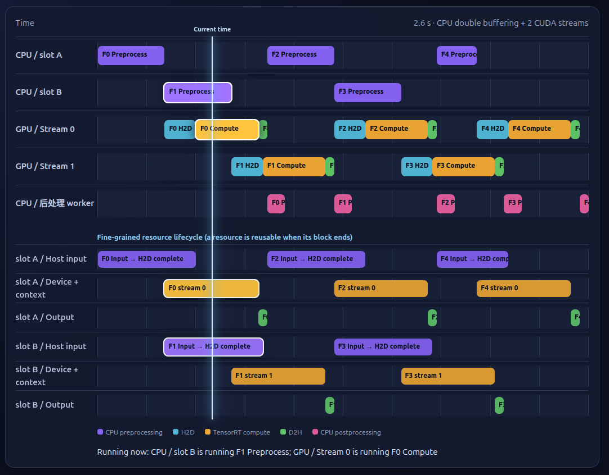

# 18 - Async Single-Stream Video Pipeline

## Purpose

This lesson turns the bounded queue from lesson 16 into a production-shaped single-stream pipeline:
capture, latest-frame backpressure, timeout-based micro-batching, two in-flight worker slots, and
capture-to-result latency metrics.

## Prerequisites

- Complete lesson 16.
- OpenCV video support is required for file or camera input; the default synthetic source needs no external media.

## Deliverables

- Reusable asynchronous single-stream pipeline library
- Runnable video-pipeline executable
- Lifecycle, overload, end-of-stream, and failure-path tests
- Browser animation in `visualization/` that makes CPU double buffering and multi-stream H2D/compute overlap visible.

## Semantics and Metrics

- Sustained overload drops the oldest queued frame to favor real-time freshness.
- Normal end-of-stream closes in drain mode; cancellation and failures discard queued work.
- Two async tasks form the double buffer: one batch can execute while the next is assembled.
- A batch is submitted when full or when `batch-timeout-ms` expires.
- Reported latency begins at capture and ends when the async result is collected.
- The executable reports FPS, P50/P90/P99 latency, queue peak, processed, and dropped frames.

Sample GPU utilization beside a real TensorRT backend with:

```bash
nvidia-smi dmon -s u -d 1 -o DT > outputs/gpu_utilization.log
```

Do not label the simulated worker's CPU timing as GPU utilization. GPU utilization must come from
the real backend run and the monitoring capture above.

## Two Complementary Forms of Overlap

This lesson's CPU-side double buffering and TensorRT's CUDA stream concurrency address different
parts of the pipeline, and are commonly combined in production:

- **CPU thread double buffering (business/framework layer)** overlaps CPU preparation—reading or
  decoding frames, resizing, and assembling batches—with GPU inference.
- **Multiple TensorRT CUDA streams (hardware/driver layer)** overlaps host-to-device (H2D) copies
  with the GPU's Tensor Core matrix computation, when the hardware, memory, and workload permit
  concurrent execution.

The two techniques are complementary rather than interchangeable: the first keeps the host busy
preparing the next work item, while the second pipelines transfers and computation on the device.
Using both requires independent per-in-flight-slot resources (for example, buffers, execution
contexts, and CUDA streams) and explicit synchronization at ownership boundaries.

## Build

Configure and build from the repository root inside the pinned development container:

```bash
cmake -S 18_async_video_pipeline -B 18_async_video_pipeline/build
cmake --build 18_async_video_pipeline/build --parallel
```

The generated build directory is ignored.

## Run

Run the commands from the repository root:

```bash
./18_async_video_pipeline/build/async_video_pipeline
```

The default synthetic source makes the artifact runnable without a camera. Use a video or camera:

```

<details><summary>Example output (local run)</summary>

```text
captured=120 processed=117 dropped=3 queue_peak=8 fps=775.29 p50_ms=12.31 p90_ms=15.27 p99_ms=16.52
```
</details>
bash
./18_async_video_pipeline/build/async_video_pipeline --input video.mp4
./18_async_video_pipeline/build/async_video_pipeline --input 0
```

Important controls are `--queue-capacity`, `--max-batch`, `--batch-timeout-ms`, and
`--inference-ms`. The last option adds a fixed artificial delay to the CPU-only mock backend; it is
not TensorRT inference time or GPU-performance evidence. The mock backend keeps queueing, overload,
shutdown, failure propagation, and metrics testable without a GPU.

A later integration can replace the mock backend with lesson 17's `DynamicBatchRunner` while
retaining capture-thread and frame-queue ownership. That integration is not a direct function
substitution: it must convert `cv::Mat` frames into the runner's batched NCHW input, validate the
batch size against the engine optimization profile, and handle the TensorRT output. Each concurrent
inference slot also needs its own TensorRT execution context, CUDA stream, and associated buffers;
do not call one lesson 17 runner concurrently from both slots.

### Failure Experiments

```bash
./18_async_video_pipeline/build/async_video_pipeline --fail-capture-at 20
./18_async_video_pipeline/build/async_video_pipeline --fail-worker-at 20
./18_async_video_pipeline/build/async_video_pipeline --input does-not-exist.mp4
```

Each returns nonzero, closes the queue, joins both threads, and propagates the original error. Tests
also verify bounded overload accounting and explicit stop without deadlock.

### Open the overlap animation

Open `18_async_video_pipeline/visualization/index.html` directly in a modern browser (no server or
extra dependency is required). Start with **No double buffer, no multiple streams** to see the fully serial baseline,
then compare **CPU double buffering only** and **CPU double buffering + 2 CUDA streams**. Press **Play**;
bright blocks mark the work currently executing, and the message below the lanes describes what is
parallel at that instant. Click a block for its exact conceptual time interval. The durations are an
explanatory model, not a benchmark or a claim about a particular GPU.

## Visual walkthrough

The lesson includes an interactive browser animation that turns the overlap model into a timeline.
The snapshot below shows the combined **CPU double buffering + 2 CUDA streams** view: slot A/B
prepare different frames while Stream 0 and Stream 1 perform H2D, TensorRT compute, and D2H.
The separate postprocessing lane and the optional resource-lifecycle detail view make ownership
boundaries explicit.



Open `visualization/index.html` in a modern browser to explore the animation yourself. It starts in
English; use the **Chinese** button in the upper-right corner to switch to Simplified Chinese. Press
**Play**, change speed, switch between the three modes, and expand **Resource lifecycle** in the
combined mode to see when host input, device/context, and output resources become reusable. The
illustration is a conceptual teaching model, not a benchmark result for a specific GPU.

## Outputs

- The executable reports FPS, P50/P90/P99 capture-to-result latency, queue peak, processed frames, and dropped frames.
- Optional monitoring logs belong under ignored `outputs/`; simulated worker timing is not GPU evidence.

## Tests

Run the configured CTest suite:

```bash
ctest --test-dir 18_async_video_pipeline/build --output-on-failure
```

## Checkpoints

1. Implement a bounded asynchronous single-stream pipeline with explicit ownership and cancellation.
2. Measure capture-to-result latency, throughput, queue depth, and dropped-frame behavior.
3. Handle end-of-stream, invalid input, overload, and worker failure without deadlock.
